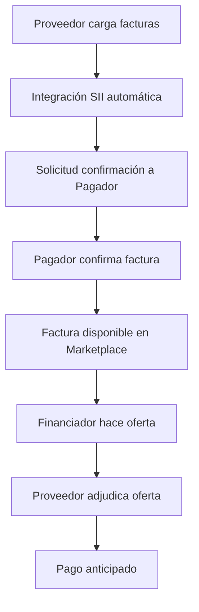

# TReDS Chile - Plataforma de Confirming Financiero

## 📋 Descripción General

TReDS Chile es una plataforma digital de confirming (factoring) que conecta tres actores principales del ecosistema financiero chileno:

- **🏭 Proveedores**: Empresas con facturas pendientes de cobro a largo plazo
- **🏢 Pagadores**: Grandes empresas que confirman la validez de facturas
- **💰 Financiadores**: Entidades financieras que adelantan pagos a tasas preferenciales

La plataforma automatiza el proceso completo desde la carga de facturas hasta el pago anticipado, con integración directa al SII (Servicio de Impuestos Internos) de Chile.

## 🏗️ Arquitectura Técnica

### Stack Tecnológico

- **Backend**: FastAPI (Python) con arquitectura modular por roles
- **Base de Datos**: SQLite + SQLAlchemy ORM + Alembic migrations
- **Frontend**: Jinja2 Templates + Bootstrap 5
- **Autenticación**: Passlib (bcrypt) + SessionMiddleware
- **Integración SII**: Selenium WebDriver + requests
- **Validación**: XML parsing para DTEs (Documentos Tributarios Electrónicos)

### Estructura del Proyecto

```
TReDS/
├── main.py                 # FastAPI app principal
├── database.py            # Configuración SQLAlchemy
├── models.py              # Modelos de datos
├── routers/               # Endpoints por rol
│   ├── proveedor.py      # Operaciones de proveedores
│   ├── pagador.py        # Operaciones de pagadores
│   ├── financiador.py    # Operaciones de financiadores
│   ├── marketplace.py    # Mercado público
│   ├── middle_office.py  # Gestión de fondos
│   └── admin.py          # Administración del sistema
├── templates/            # Templates HTML (Jinja2)
├── static/              # Assets estáticos
├── selenium_scripts/    # Integración SII
└── alembic/            # Migraciones de BD
```

## 🔄 Flujo de Negocio Principal



## 🚀 Instalación y Configuración

### Prerrequisitos

- Python 3.8+
- Chrome/Chromium (para integración SII)
- ChromeDriver

### Instalación

```bash
# Clonar repositorio
git clone <repository-url>
cd TReDS_Version_Fintnery

# Instalar dependencias
pip install fastapi uvicorn sqlalchemy alembic passlib python-dotenv
pip install selenium requests jinja2 python-multipart

# Configurar variables de entorno
cp .env.example .env
# Editar .env con tus configuraciones
```

### Variables de Entorno (.env)

```env
SECRET_KEY=tu_clave_secreta_para_sesiones
ADMIN_ACCESS_KEY=clave_maestra_middle_office
RESET_TOKEN=token_para_reset_bd
```

### Inicialización de Base de Datos

```bash
# Crear migraciones
alembic upgrade head

# Ejecutar aplicación
uvicorn main:app --reload --host 0.0.0.0 --port 8000
```

## 👥 Módulos por Rol de Usuario

### 🏭 Módulo Proveedor

**Funcionalidades principales:**

- ✅ Carga manual de facturas XML (DTE tipo 33)
- ✅ **Importación automática desde SII**
- ✅ Solicitud de confirmación a pagadores
- ✅ Gestión de ofertas de financiamiento
- ✅ Adjudicación de ofertas

**Endpoints clave:**

- `GET /proveedor/facturas` - Dashboard de facturas
- `POST /proveedor/importar_sii_facturas` - Importación SII
- `GET /proveedor/solicitar_confirmacion/{folio}` - Solicitar confirmación

### 🏢 Módulo Pagador

**Funcionalidades principales:**

- ✅ Visualización de facturas pendientes
- ✅ Confirmación/rechazo de facturas
- ✅ Modificación de fechas de vencimiento
- ✅ Dashboard de gestión

**Endpoints clave:**

- `GET /pagador/facturas` - Facturas pendientes y gestionadas
- `POST /pagador/confirmar-factura/{folio}` - Confirmar factura

### 💰 Módulo Financiador

**Funcionalidades principales:**

- ✅ Marketplace de facturas confirmadas
- ✅ Sistema de ofertas con cálculo automático
- ✅ Gestión de condiciones por pagador
- ✅ Control diario de costo de fondos
- ✅ Roles administrativos

**Endpoints clave:**

- `GET /financiador/marketplace` - Facturas disponibles
- `POST /financiador/registrar-oferta/{folio}` - Crear oferta
- `GET /financiador/costo-fondos` - Actualizar costos

## 🗄️ Modelos de Datos Principales

### Proveedor

```python
class Proveedor(Base):
    id: int
    nombre: str
    rut: str (unique)
    usuario: str (unique)
    clave_hash: str
    razon_social: str
    clave_sii: str          # Para integración SII
    cookies_sii_path: str   # Sesión SII
```

### FacturaDB

```python
class FacturaDB(Base):
    id: int
    rut_emisor: str
    rut_receptor: str
    tipo_dte: str
    folio: int
    monto: int
    estado_dte: str
    fecha_emision: date
    fecha_vencimiento: date
    confirming_solicitado: bool
    financiador_adjudicado: int
```

### OfertaFinanciamiento

```python
class OfertaFinanciamiento(Base):
    id: int
    tasa_interes: float
    dias_anticipacion: int
    monto_total: float
    comision_flat: float
    precio_cesion: float
    estado: str
```

## 🔐 Seguridad y Cumplimiento

### Autenticación

- **Roles separados**: Sesiones independientes por tipo de usuario
- **Hash seguro**: bcrypt para contraseñas
- **Validación RUT**: Formato y dígito verificador chileno

### Integración SII

- **Autenticación oficial**: Login directo en portal SII
- **Validación DTE**: Verificación de documentos tributarios
- **Trazabilidad**: Registro de origen (Manual/SII)

### Controles Financieros

- **Validación cruzada**: RUT emisor vs proveedor
- **Estados inmutables**: Control de flujo de facturas
- **Cálculos automáticos**: Tasas e intereses

## 🚀 Uso de la Aplicación

### 1. Acceso por Roles

- **Proveedores**: `http://localhost:8000/proveedor/login`
- **Pagadores**: `http://localhost:8000/pagador/login`
- **Financiadores**: `http://localhost:8000/financiador/login`
- **Middle Office**: `http://localhost:8000/middle/login`

### 2. Flujo Típico de Uso

#### Para Proveedores:

1. Login con credenciales
2. Importar facturas desde SII o cargar XML manualmente
3. Solicitar confirmación a pagadores
4. Revisar ofertas de financiamiento
5. Adjudicar mejor oferta

#### Para Pagadores:

1. Login con credenciales
2. Revisar facturas pendientes de confirmación
3. Confirmar o rechazar facturas
4. Gestionar fechas de vencimiento

#### Para Financiadores:

1. Login con credenciales
2. Actualizar costo de fondos diario
3. Configurar condiciones por pagador
4. Revisar marketplace de facturas
5. Realizar ofertas competitivas

## 🔧 Integración SII (Automatización)

La plataforma incluye scripts automatizados para integración con el SII:

### Scripts Principales:

- `login_sii.py` - Autenticación automática en SII
- `consultar_dte.py` - Consulta de resumen de DTEs
- `detalle_dte.py` - Descarga de detalles de facturas

### Proceso Automatizado:

1. **Selenium** automatiza login en portal SII
2. **Requests** consulta APIs oficiales del SII
3. **XML parsing** extrae datos de DTEs
4. **Validación** cruza información con base de datos
5. **Importación** crea registros automáticamente

## 📊 Estados de Factura

| Estado                                | Descripción                    | Actor Responsable |
| ------------------------------------- | ------------------------------ | ----------------- |
| `Cargada`                             | Factura recién importada       | Proveedor         |
| `Confirmación solicitada al pagador`  | Esperando confirmación         | Pagador           |
| `Confirmada por pagador`              | Lista para financiamiento      | Proveedor         |
| `Confirming solicitado`               | Disponible en marketplace      | Financiador       |
| `Confirming adjudicado`               | Financiador asignado           | Sistema           |
| `Vencimiento rechazado por proveedor` | Proveedor rechaza modificación | Proveedor         |

## 💡 Características Destacadas

### 🔄 Automatización SII

- **Integración nativa** con el Servicio de Impuestos Internos de Chile
- **Importación automática** de DTEs (Documentos Tributarios Electrónicos)
- **Validación cruzada** de información tributaria
- **Trazabilidad completa** del origen de datos

### 💰 Cálculos Financieros Automáticos

- **Tasa de interés** = Costo de fondos + Spread por pagador
- **Precio de cesión** = Monto factura - (Intereses + Comisiones)
- **Días de anticipación** configurables por relación comercial
- **Condiciones personalizadas** por pagador

### 🏛️ Arquitectura Multi-Tenant

- **Fondos independientes** con administradores propios
- **Roles jerárquicos** dentro de cada fondo
- **Configuraciones específicas** por entidad financiera
- **Marketplace unificado** para todas las oportunidades

## 🛠️ Desarrollo y Contribución

### Estructura de Desarrollo

```bash
# Ejecutar en modo desarrollo
uvicorn main:app --reload

# Crear nueva migración
alembic revision --autogenerate -m "descripcion_cambio"

# Aplicar migraciones
alembic upgrade head
```

### Testing

```bash
# Ejecutar tests (cuando estén implementados)
pytest tests/

# Verificar integración SII
python selenium_scripts/login_sii.py

# Verificar conectividad de base de datos
python -c "from database import engine; print('DB OK' if engine else 'DB Error')"
```

## 🔧 Troubleshooting

### Problemas Comunes

#### Error de Conexión SII

```bash
# Verificar ChromeDriver
chromedriver --version

# Actualizar dependencias Selenium
pip install --upgrade selenium
```

#### Error de Base de Datos

```bash
# Recrear base de datos
rm treds.db
alembic upgrade head
```

#### Error de Sesión

```bash
# Limpiar cookies SII
rm -rf selenium_scripts/facturas_sii/cookies/
```

### Variables de Entorno Requeridas

```env
# Obligatorias
SECRET_KEY=clave_minimo_32_caracteres
ADMIN_ACCESS_KEY=clave_middle_office

# Opcionales
RESET_TOKEN=token_reset_bd
DATABASE_URL=sqlite:///./treds.db
```

## 📋 Checklist de Implementación

### Para Producción

- [ ] Migrar a PostgreSQL
- [ ] Configurar HTTPS/SSL
- [ ] Implementar backup automático
- [ ] Configurar logging centralizado
- [ ] Establecer monitoreo de salud
- [ ] Configurar alertas de errores
- [ ] Implementar rate limiting
- [ ] Configurar firewall de aplicación
